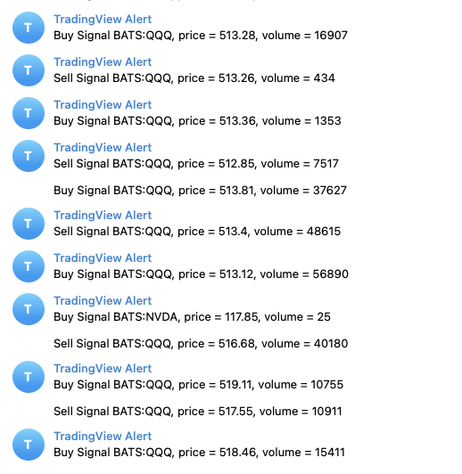

# TradingView Alert to Telegram via Cloudflare Worker

This project is a Cloudflare Worker that receives webhooks from TradingView and forwards them to Telegram.



## Setup Instructions

1. Install dependencies:
```bash
bun install
```

2. Configure your environment variables:
   - Get your Telegram Bot Token from [@BotFather](https://t.me/botfather)
   - Get your Telegram Chat ID (you can use [@getidsbot](https://t.me/getidsbot))
   - Add these values to your wrangler.toml or set them using:
```bash
wrangler secret put TELEGRAM_BOT_TOKEN
wrangler secret put TELEGRAM_CHAT_ID
```

3. Deploy the worker:
```bash
bun run deploy
```

4. Set up TradingView Alert:
   - In TradingView, create a new alert
   - Set the "Webhook URL" to your Cloudflare Worker URL
   - Format your alert message in the "Message" field
   - The alert will be sent as plain text to your Telegram chat


## Development

To run locally:
```bash
bun run dev
```

## Testing

You can test the webhook using curl in two ways:

1. Using plain text (recommended for TradingView):
```bash
curl -H 'Content-Type: text/plain; charset=utf-8' -d 'BTCUSD Greater Than 9000' -X POST https://your-worker-url.workers.dev
```

2. Using JSON format:
```bash
curl -H 'Content-Type: application/json; charset=utf-8' -d '{"text": "BTCUSD Greater Than 9000"}' -X POST https://your-worker-url.workers.dev
```